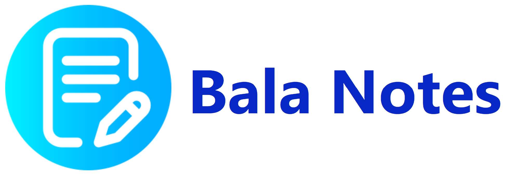
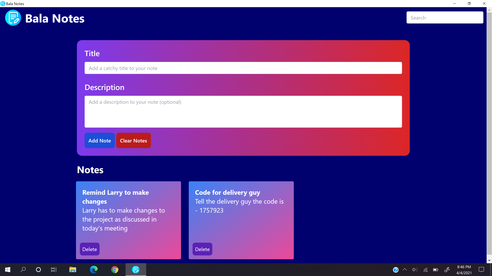
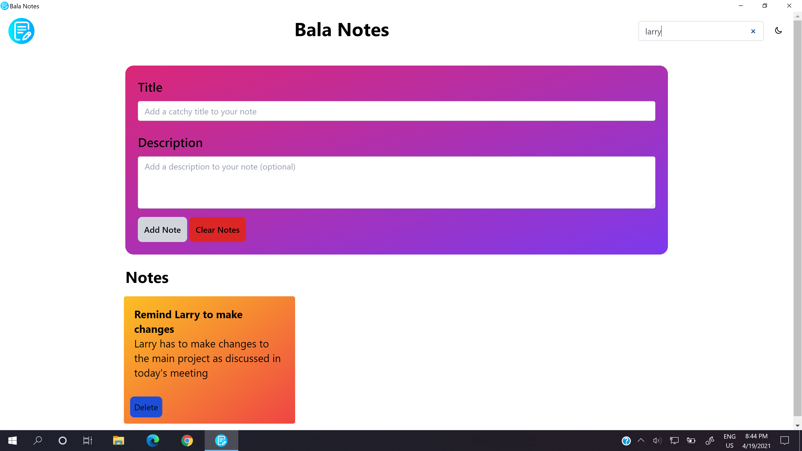

# Bala Notes



<span> [](./LICENSE) [](https://www.electronjs.org/) [](https://tailwindcss.com/) </span>

## About

Bala Notes is an open source note taking app. It is licensed under the MIT License.

## Screenshots




## Downloads
 Windows

Windows 10
- [Windows 32-bit](https://github.com/K-Balaji/BalaNotes/releases/download/5.5.0/Bala_Notes_Setup_x86.exe) (55.4 MB)
- [Windows 64-bit](https://github.com/K-Balaji/BalaNotes/releases/download/5.5.0/Bala_Notes_Setup_x64.exe) (58.2 MB)
- [Portable App](https://github.com/K-Balaji/BalaNotes/releases/download/5.0.0/Bala_Notes_Portable.exe) (148 MB)

Windows XP to Windows 8 (Experimental)
- [Windows 32-bit](https://github.com/K-Balaji/BalaNotes/releases/download/5.5.0/Bala_Notes_Setup_Legacy_x86.exe) (31.6 MB)
- [Windows 64-bit](https://github.com/K-Balaji/BalaNotes/releases/download/5.5.0/Bala_Notes_Setup_Legacy_x64.exe) (38.1 MB)

## Test Locally (for Windows, MacOS and Linux)

1. Install the latest version of <a href="https://nodejs.org/" target="_blank">Node.js</a>. This will install the Node Package Manager (NPM) that we will use later.
2. Download the above repository as a ZIP File.
3. Extract the ZIP File to a directory of your choice.
4. Open your terminal and navigate to that directory.
5. Now enter the following in the terminal and wait for the dependencies to be installed and the app to launch -

```sh
npm install
npm start
```

## Technologies used

- <a href="https://www.electronjs.org/" target="_blank">Electron</a>
- Web Technologies (HTML, CSS, JavaScript)
- <a href="https://tailwindcss.com/" target="_blank">Tailwind CSS</a>

## Future Plans

- App support for Linux OS
- Apart from this, bugs shall be fixed (if any) and new features shall be added

## Contributing

To contribute to this project, make a pull request.

## License

[MIT License](./LICENSE)
