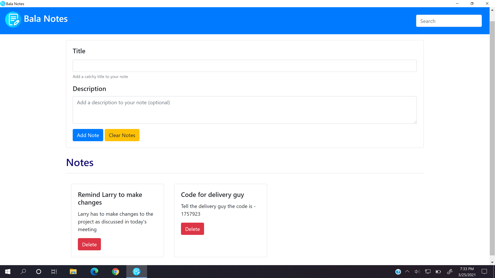
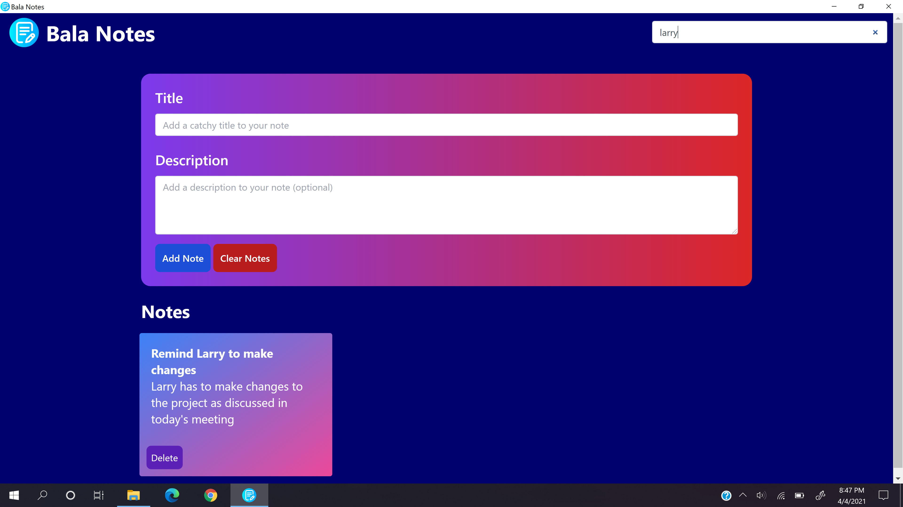

# Bala Notes
## About
Bala Notes is an open source note taking app. It is licensed under the MIT License.

## Screenshots



## Downloads
- [Windows 32-bit (x86) and 64-bit (x64) (Recommended)](https://github.com/K-Balaji/BalaNotes/releases/download/2.0.0/Bala_Notes_Setup_x86_x64.exe)
- [Portable App](https://github.com/K-Balaji/BalaNotes/releases/download/2.0.0/Bala_Notes_Portable.exe)
- [MSI Installer 32-bit (x86)](https://github.com/K-Balaji/BalaNotes/releases/download/2.0.0/Bala_Notes_x86.msi)
- [MSI Installer 64-bit (x64)](https://github.com/K-Balaji/BalaNotes/releases/download/2.0.0/Bala_Notes_x86.msi)

## Test Locally
1. Install the latest version of <a href="https://nodejs.org/" target="_blank">Node.js</a>. This will install the Node Package Manager (NPM) that we will use later.
2. Download the above repository as a ZIP File.
3. Extract the ZIP File to a directory of your choice.
4. Open your terminal and navigate to that directory.
5. Now enter the following in the terminal and wait for the dependencies to be installed and the app to launch - 
```sh
npm install
npm start
```

## Technologies used
- <a href="https://github.com/electron/electron" target="_blank">Electron</a>
- Web Technologies (HTML, CSS, JavaScript)
- <a href="https://github.com/twbs/bootstrap" target="_blank">Bootstrap</a>

## Future Plans
- Use of Tailwind CSS and Tailwind UI instead of Bootstrap
- Apart from this, bugs shall be fixed (if any) and new features shall be added

## Contributing
To contribute to this project, make a pull request.

## License
[MIT License](./LICENSE)
